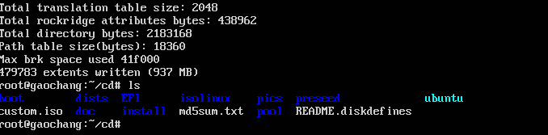

## 实验一：无人值守安装iso制作 
### 实验特性
- 定制一个普通用户名和默认密码
- 定制安装OpenSSH Server
- 安装过程禁止自动联网更新软件包

### 软件环境
- Ubuntu 18.04.4 Server 64bit
- Virtualbox
- putty
  
### 实验步骤

#### 

**1.在虚拟机未启动前，配置双网卡** 

在虚拟机未启动前的操作

>设置->网络->网卡1（连接方式为NAT）->网卡2（连接方式为Host-only网络）

两块网卡均已启动网络连接

**2. 在服务器中启动第二块网卡**

输入ifconfig命令后发现第二块网卡未启动，手动启动的命令：


>sudo ifconfig emp0s8 up  
>sudo dhclient emp0s8  
>ifconfig -a(查看是否开启&&ip地址）

观察到第二块网卡已经启动成功


获取到ip地址为：192.168.56.101

**3.在Ubuntu中安装ssh服务**

更新源
>sudo apt-get update   

安装ssh服务
>sudo apt-get install ssh openssh-server

**4，建立putty连接** 

>输入Host Name并Saved Sessions

**5. 把windows本地镜像传到虚拟机中去**

使用PUTTY中的PSFTP将windows本机镜像文件传到虚拟机中
>put C:\ubuntu-18.04.4-server-amd64.iso

如图，文件已成功传递


**6. 在当前用户目录下创建一个用于挂载iso镜像文件的目录**

>mkdir loopdir

**7.挂载iso镜像文件到该目录**

>sudo mount -o loop ubuntu-16.04.1-server-amd64.iso loopdir


**8. 创建一个工作目录用于克隆光盘内容**

>mkdir cd

**9.同步光盘内容到目标工作目录**

>rsync -av loopdir/ cd


**10.卸载iso镜像**

>sudo umount loopdir

**11.添加自动安装菜单选项**

编辑Ubuntu安装引导界面增加一个新菜单项入口

>cd cd/  
>vim isolinux/txt.cfg

添加以下内容到该文件后强制保存退出（以下内容要添加在首部）

>label autoinstall
  menu label ^Auto Install Ubuntu Server
  kernel /install/vmlinuz
  append  file=/cdrom/preseed/ubuntu-server-autoinstall.seed debian-installer/locale=en_US console-setup/layoutcode=us keyboard-configuration/layoutcode=us console-setup/ask_detect=false localechooser/translation/warn-light=true localechooser/translation/warn-severe=true initrd=/install/initrd.gz root=/dev/ram rw quiet

强制退出：
先按Esc，再输入:wq!  
增加结果如下：


**12.自行修改编辑定制Ubuntu官方提供的示例preseed.cfg**

修改地方：  
根据老师提供的.seed文件，修改了用户名和密码  
~~（由于第一次修改时，改错了静态网络的IP、网关导致第一次安装需要手动添加命令）~~

**13.将修改好的ubuntu-server-autoinstall.seed上传，并将该文件保存到刚才创建的工作目录：~/cd/preseed/ubuntu-server-autoinstall.seed**


上传过程：
先将.seed文件传到/home/gaochangchang的目录下，再将.seed文件移动到~/cd/preseed目录下

上传：
> put C:\ubuntu-server-autoinstall.seed

移动：
> sudo mv ubuntu-server-autoinstall.seed cd/preseed

查看发现移动成功


**14.更改isolinux/isolinux.cfg
增加timeout 10**

>sudo vim isolinux/isolinux.cfg


**15.重新生成md5sum.txt**
 
>sudo -s  
find . -type f -print0 | xargs -0 md5sum > md5sum.txt


**16.打包改动后的目录为.iso文件**

```
#建立shell脚本
sudo vim shell
#添加以下内容到脚本中
IMAGE=custom.iso
BUILD=/home/gaochangchang/cd/
mkisofs -r -V "Custom Ubuntu Install CD" \
            -cache-inodes \
            -J -l -b isolinux/isolinux.bin \
            -c isolinux/boot.cat -no-emul-boot \
            -boot-load-size 4 -boot-info-table \
            -o $IMAGE $BUILD
#执行shell脚本
sudo bash shell 
```
出现错误：提示安装genisoimage
>sudo apt-get install genisoimage

查看建好了的iso镜像文件



**17.导出.iso镜像文件**

无法将iso镜像文件到C盘，更改导出路径到D盘
>lcd D:\  
get custom.iso

  

### 实验结果
装载custom.iso后，就可以静静等着它自动安装了


### 遇到的问题和解决方法

- 很多命令没有权限执行，如挂载iso镜像文件到该目录的命令，前面加上**sudo**  
  
- 在创建克隆光盘文件时忘记退出loopdir的文件夹，于是删除重新执行 `rm -r cd`命令

  
- 第一次制作custom.iso时，修改了静态网络的ipaddress成192.168.56.101，gateway和nameservers都修改成192.168.56.1，以及用户名和密码，但是在configure the network配置IP地址时，需要手动输（第一次的custom.iso配置失败）目前还不知道应该怎么修改静态网络.....
   - 解决方法如下：
      - 禁用网络自动配置：将第44行中`#d-i netcfg/disable_autoconfig boolean true`改为`d-i netcfg/disable_autoconfig boolean false`
      - 静态网络的配置：
        ```
        #修改IPV4
        #去掉原文前面的#号并修改相应的数值
        d-i netcfg/get_ipaddress string 192.168.56.101
        d-i netcfg/get_netmask string 255.255.255.0
        d-i netcfg/get_gateway string 192.168.56.1
        d-i netcfg/get_nameservers string 192.168.56.1
     - 为确保上述修改有效，且恰好留着在导入.seed文件前的备份，故实战一下，发现静态网络问题确实解决了（感谢师哥），但与此同时需要做一些其他的修改才能保证实现无人值守，相关修改已上传 ~~简易版老师的.seed文件 很多地方没有考虑周全,用了9分多钟~~
   - 解决以上问题后，一切顺利~
    

        
### 参考文献
[老师的无人值守安装ISO镜像课件](https://c4pr1c3.github.io/LinuxSysAdmin/chap0x01.exp.md.html#/iso)

[2015-linux-public-tyushua1](https://github.com/CUCCS/2015-linux-public-tyushua1/commit/6e084fdfdb5acd4dc3dff6abc292b2f0173ae4fa?short_path=201e948)

  

