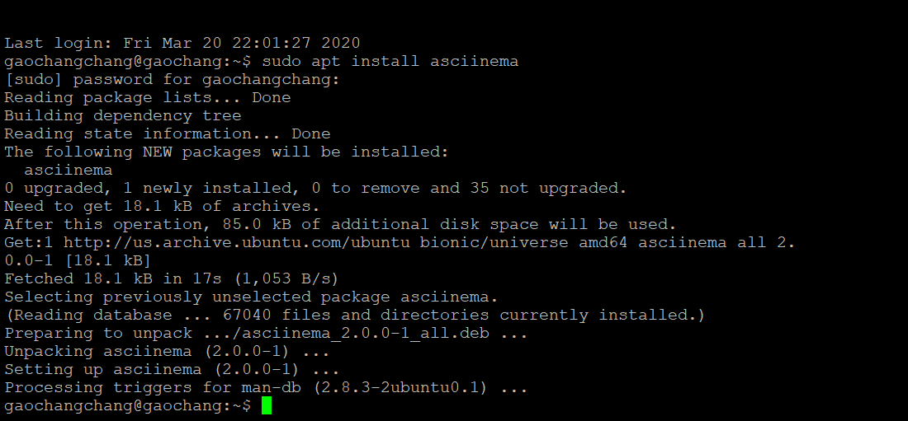

## 实验二：From GUI to CLI
### 实验要求
- 在asciinema注册在线账号，与本地账号建立连接
- 自学vimtutor教程并**全程分章节**录屏
- 完成自查清单

### 软件环境
- Ubuntu 18.04.4 Server 64bit
- asciinema
  
### 实验步骤

#### 

**1.本地安装asciinema** 
>sudo apt install asciinema

**2. 建立在线账号和本地账号的连接**

>asciinema auth  

观察到已经成功建立连接

**3.视频录制**

>asciinema rec

**4.录制结束** 

>exit / ctrl-d

### 实验结果
[第一节自学视频录制](https://asciinema.org/a/RUuwWKwDva3426wFryJfZGdSx)

[第二节自学视频录制](https://asciinema.org/a/pOuOS9U0EXw37uBoadvq7u9RX)

[第三节自学视频录制](https://asciinema.org/a/JB6pROMqyvkj1EfmxMXnduuV7)

[第四节自学视频录制](https://asciinema.org/a/A4I1O4Do4LvnkGw9O9eEOKYLa)

[第五节自学视频录制](https://asciinema.org/a/qean8ALeGqJgQGw4WNauSnn9a)

[第六节自学视频录制](https://asciinema.org/a/knrhv91hGUdWueUYcgN2F9Ogw)

[第七节自学视频录制](https://asciinema.org/a/2SYojIEmqHGuw53htc72yTZ2w)

### Vimtutor完成后的自查清单
- **你了解vim有哪几种工作模式？**
  
  共六种工作模式 , 如下：
   - Normal Mode
     - 正常模式：一般用于浏览文件，也包括一些复制、粘贴、删除等操作 
   - Visual Mode
     - 可视模式：被选中的文本高亮可视 
   - Select Mode
     -  选择模式：鼠标或者光标键高亮选择文本
   - Insert Mode
     - 插入模式：插入要写入的字符 
   - Command-line Mode
     - 命令行模式：可以输入命令 
   - Ex Mode
     - Ex模式：在常规模式下，使用Q命令，可以进入Ex模式（~~但是还没搞懂这是个什么模式QAQ~~）
- **Normal模式下，从当前行开始，一次向下移动光标10行的操作方法？如何快速移动到文件开始行和结束行？如何快速跳转到文件中的第N行？**  
  - 向下移动光标10行：`10j`
  - 移动到开始行：`gg`    
  - 移动到结束行：`G`
  - 跳转文件的第N行：`NG`或者`Ngg`
   
- **Normal模式下，如何删除单个字符、单个单词、从当前光标位置一直删除到行尾、单行、当前行开始向下数N行？**
  - 删除单个字符：`x`
  - 删除整个单词：`dw`或者`de`
  - 删除到行尾：`d$`
  - 删除单行：`dd`
  - 删除从当前行开始向下数N行：`Ndd`或者`dNd`
- **如何在vim中快速插入N个空行？如何在vim中快速输入80个-？**
  - vim中插入N个空行：`No ESC`
  - 快速输入80个-：`80i- ESC`
- **如何撤销最近一次编辑操作？如何重做最近一次被撤销的操作？**
  - 撤销最近一次编辑操作：`u`
  - 重做最近一次被撤销的操作：`Ctrl+R`
   
- **vim中如何实现剪切粘贴单个字符？单个单词？单行？如何实现相似的复制粘贴操作呢？**
  - 剪切粘贴单个字符：`x p`或者`d p`
  - 剪切粘贴单个单词：`dw p`
  - 剪切粘贴单行：`dd p`
  - 复制粘贴：按`v`进入Visual Mode后选择要复制的内容，按`y ESC`复制并退出到Normal Mode，按`p`来粘贴
- **为了编辑一段文本你能想到哪几种操作方式（按键序列）？**
   - 插入
      - 当前字符前插入：`i`
      - 当前字符后插入：`a`  
   - 更改
      - 更改一段字符（到下一段字符以前）：`:ce`或者`:cw`
      - 更改该字符到整行末尾：`c$`
   - 替换
      - 替换一个字符：按`R`后输入替换后的字符
      - 替换第一段old字符为new字符：`:s/old/new`
      - 替换所有old字符为new字符：`:s/old/new/g`
  
   - 退出
      - 直接退出：`:q!`
      - 保存并退出：`:wq`  
  - 删除
  - 剪切粘贴&&复制粘贴

- **查看当前正在编辑的文件名的方法？查看当前光标所在行的行号的方法？**  
  -  同时查看：`Ctrl+G`
- **在文件中进行关键词搜索你会哪些方法？如何设置忽略大小写的情况下进行匹配搜索？如何将匹配的搜索结果进行高亮显示？如何对匹配到的关键词进行批量替换？**  
  - 方法：`/关键字`或者`?关键字`，
     - 找下一个：`n`
     - 找上一个：`N`
  - 忽略大小写：`set ic`
  - 高亮显示：`set hls is`
  - 批量替换：`:s/old/new/g`
- **在文件中最近编辑过的位置来回快速跳转的方法？**
  - 向前跳转：`Ctrl+o`或者`Ctrl+O`
  - 向后跳转：`CTRL+i`或者`Ctrl+I`
- **如何把光标定位到各种括号的匹配项？例如：找到(, [, or {对应匹配的),], or }**
  - 将光标停在要查询的括号上，输入`%`即可跳转匹配项
- **在不退出vim的情况下执行一个外部程序的方法？**
  - `:!+程序名称`
- **如何使用vim的内置帮助系统来查询一个内置默认快捷键的使用方法？如何在两个不同的分屏窗口中移动光标？**
  - 查询内置默认快捷键：`:help+快捷键名称`
  - 移动光标：`Ctrl+W`

### 遇到的问题和解决方法

- 上传的时候报错`asciinema: upload failed: <urlopen error [Errno -3] Temporary failure in name resolution>`，具体原因如下：
  1. 没与在线账号连接上，重新执行`asciinema auth`
  2. 开了全屏....(TAT)  
- vim中的ex模式是一种什么模式（还没查清楚）

  

   
   

  

