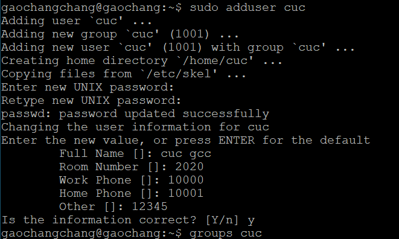
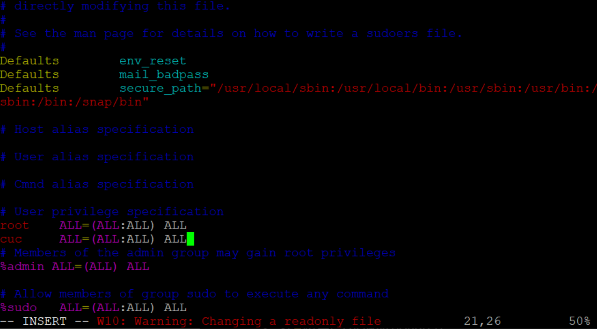
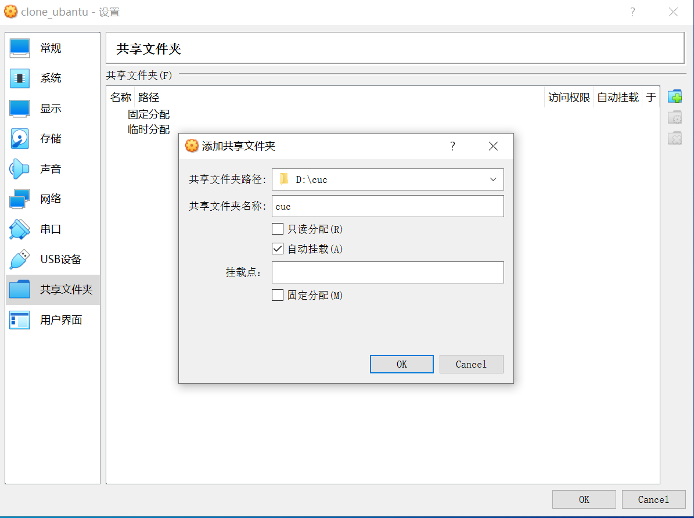
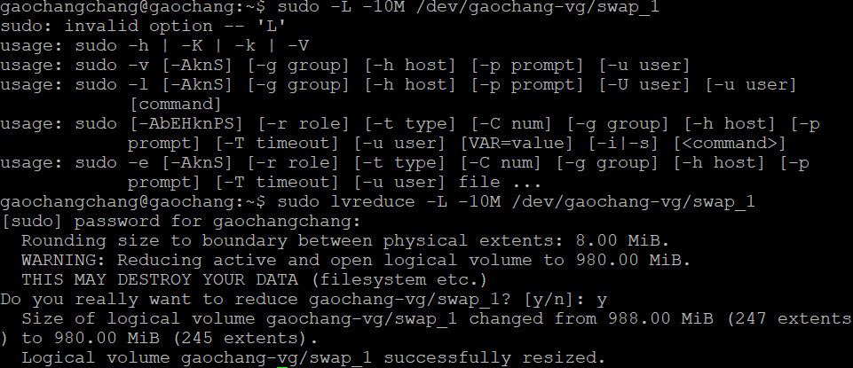
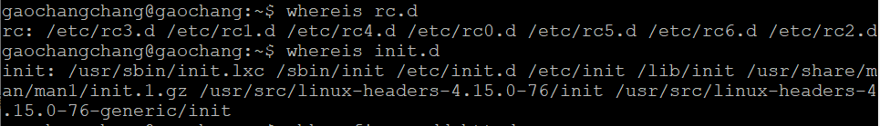

  
  ## 实验三：动手实战Systemd
### 实验要求
- 阅读以下两篇文章
  - [Systemd 入门教程：命令篇 by 阮一峰的网络日志](http://www.ruanyifeng.com/blog/2016/03/systemd-tutorial-commands.html)
  - [Systemd 入门教程：实战篇 by 阮一峰的网络日志](http://www.ruanyifeng.com/blog/2016/03/systemd-tutorial-part-two.html)
- 动手实战并录屏上传至asciinema
- 完成本章自查清单

### 软件环境
- Ubuntu 18.04.4 Server 64bit
- Putty
- asciinema
  
### 实验步骤

详见两篇博客及视频命令

### 实验结果
- 命令篇
  - [系统管理](https://asciinema.org/a/jvWlWlzAfMl6m2VlV22vjjZBI)
  - [Unit]( https://asciinema.org/a/cNTu6CVZk5juSayrGvqjKlb5y)
  - [Unit 的配置文件](
    https://asciinema.org/a/fVT7m8LVWuz56yiIlX4Cf1wwH
)
  - [Target](https://asciinema.org/a/d91kX2tEImrcaZ3I4oVvUWOEW
)
  - [日志管理](https://asciinema.org/a/3jQdFxstRsv19ZXUFHzZWzTJi
)

- 实战篇
  - [相关指令](https://asciinema.org/a/bZ9cNSSb9dioUdqtXGOy425dy
)


### 本章完成后的自查清单
**1.如何添加一个用户并使其具备sudo执行程序的权限？**
  
  - 添加用户cuc：`sudo adduser cuc` 
            
    
  - 使用户cuc具有sudo执行权限：
      ```
      # 添加用户cuc到sudo组

      # 第一种方法
      sudo adduser cuc sudo

      # 第二种方法
      sudo usermod -a -G sudo cuc

      # 普通用户提权
      
      输入vi /etc/sudoers
      添加一行：cuc ALL=(ALL) ALL
      ```

      添加用户cuc到sudo组：

         

      普通用户提权：

                    
       

**2.如何将一个用户添加到一个用户组？**  
  - 见👆将用户cuc添加到sudo用户组

**3.如何查看当前系统的分区表和文件系统详细信息?**
  - 查看分区表：`sudo fdisk -l`或`sudo sdisk -l`
  - 查看文件系统信息：`df -a`
  
**4.如何实现开机自动挂载Virtualbox的共享目录分区？**
  - 设置VirtualBox共享的本地文件夹    
  
     
  - 创建一个共享目录
    ```
    sudo mkdir /mnt/share
    ```
  - 挂载
    ```
    sudo mount -t vboxsf cuc /mnt/share
    ```
    报错

    `mount: /mnt/share: wrong fs type, bad option, bad superblock on cuc, missing codepage or helper program, or other error.`

    解决方法
    ```
    # 先执行下述两条命令

    sudo apt-get install virtualbox-guest-utils
    sudo apt install nfs-common    

    # 再次执行挂载命令

    sudo mount -t vboxsf cuc /mnt/share
    ```
  - 检查发现挂载成功
  
      

     Ps:D盘的cuc目录下有一个success-prove.txt的文件

**5.基于LVM（逻辑分卷管理）的分区如何实现动态扩容和缩减容量？**
  - 显示分区：`lvdisplay`
  - 扩充容量：`lvextend -L -size /dev/dir`
      
  - 缩减容量：`lvreduce -L +size /dev/dir`
       

**6.如何通过systemd设置实现在网络连通时运行一个指定脚本，在网络断开时运行另一个脚本？**
 
  ```
  # 修改systemd-networkd.service配置文件，并添加两行
    ExecStartPost=一个指定脚本
    ExecStopPost=另一个脚本

  # 重载配置文件
  sudo systemctl daemon-reload
  ```


**7.如何通过systemd设置实现一个脚本在任何情况下被杀死之后会立即重新启动？实现杀不死？**  
    
  ```
  # 修改该脚本配置文件中的service部分 

  # 打开配置文件
  sudo systemctl vi 文件名

  # 修改Restart部分
  Restart:always

  # 重载配置文件
sudo systemctl daemon-reload
  ```
### 遇到的问题和解决方法
**文件管理**   
   
  在执行以下语句时
  - $ sudo timedatectl set-time YYYY-MM-DD 
  - $ sudo timedatectl set-time HH:MM:SS    

  报错`Failed to set time: Automatic time synchronization is enabled`

  解决方法：先执行`timedatectl set-ntp no`，再执行更改语句


**Unit的配置文件**

在设置httpd.service的指定属性时
- sudo systemctl set-property httpd.service CPUShares=500

报错`Failed to set unit properties on httpd.service: Unit httpd.service not found.`

解决方法：上网查资料显示，原因是没有把httpd服务添加到Linux的service里面，方法是先把apachectl文件拷贝到 /etc/rc.d/init.d 中，但是没有找到这个目录QAQ  （所以这个问题还没有解决...)

 


   
### 参考文献
[Linux-user-group添加与删除](https://www.cnblogs.com/ronghui/p/8944804.html)

[虚拟机VirtualBox共享挂载问题](https://www.cnblogs.com/xuange306/p/11226292.html
)

[无法启动httpd服务](https://blog.csdn.net/weixin_41915416/article/details/94623453)

 [Systemd 入门教程：命令篇 by 阮一峰的网络日志](http://www.ruanyifeng.com/blog/2016/03/systemd-tutorial-commands.html)

  [Systemd 入门教程：实战篇 by 阮一峰的网络日志](http://www.ruanyifeng.com/blog/2016/03/systemd-tutorial-part-two.html) 


  
  

