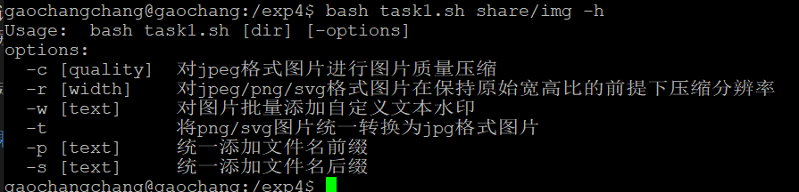
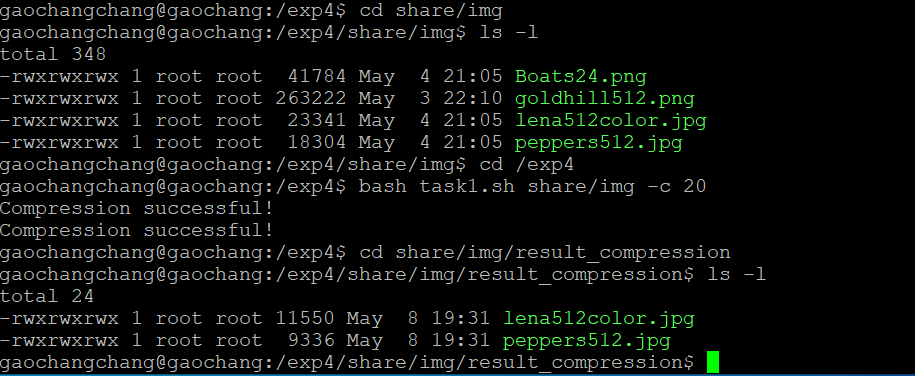
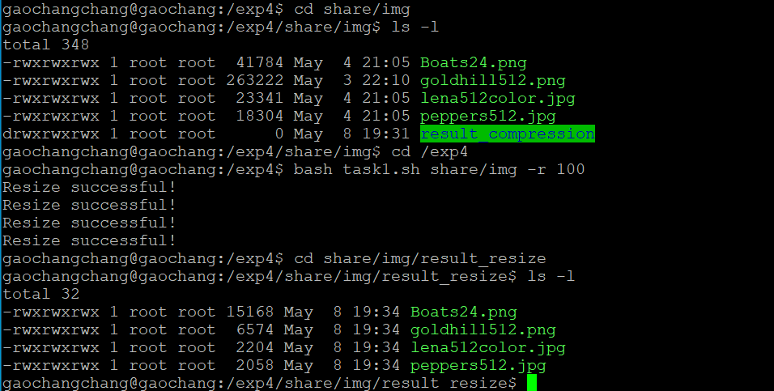
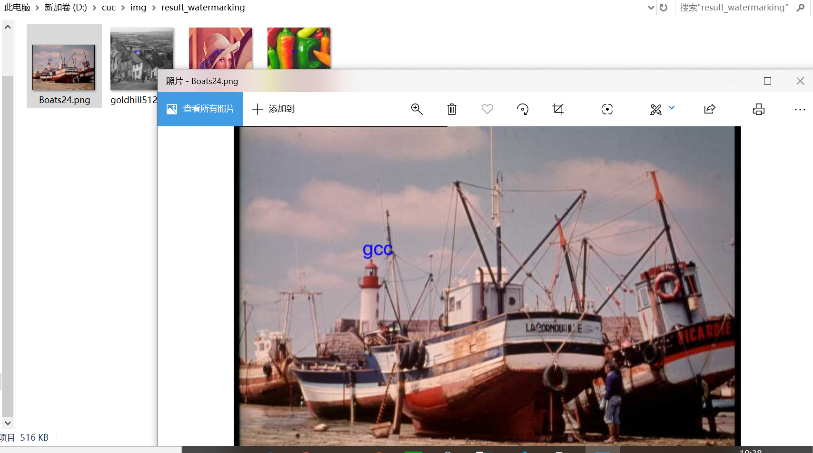
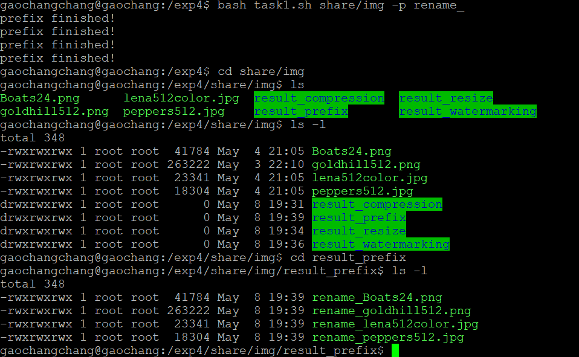
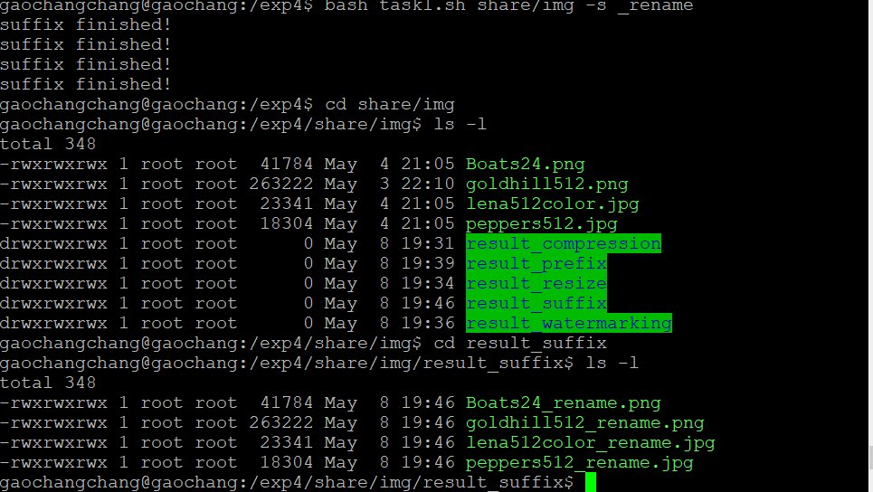
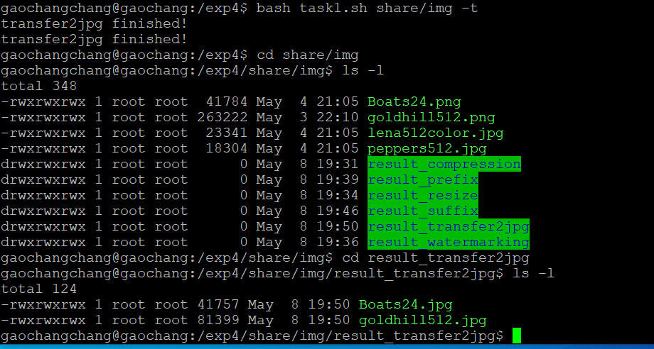

## 实验四：shell脚本编程基础

### 实验环境
- Ubuntu 18.04.4 Server 64bit
    - imagemagick
- Putty

### 实验要求
- 任务一：用bash编写一个图片批处理脚本，实现以下功能： 
  - [x] 支持命令行参数方式使用不同功能
  - [x] 支持对指定目录下所有支持格式的图片文件进行批处理      
  - [x] 支持以下常见图片批处理功能的单独使用或组合使用 
  - [x] 支持对jpeg格式图片进行图片质量压缩
  - [x] 支持对jpeg/png/svg格式图片在保持原始宽高比的前提下压缩分辨率
  - [x] 支持对图片批量添加自定义文本水印
  - [x] 支持批量重命名（统一添加文件名前缀或后缀，不影响原始文件扩展名）
  - [x] 支持将png/svg图片统一转换为jpg格式图片


- 任务二：用bash编写一个文本批处理脚本，对以下附件分别进行批量处理完成相应的数据统计任务： 

  - [x] 统计不同年龄区间范围（20岁以下、[20-30]、30岁以上）的球员数量、百分比
  - [x] 统计不同场上位置的球员数量、百分比
  - [x] 名字最长的球员是谁？名字最短的球员是谁？
  - [x] 年龄最大的球员是谁？年龄最小的球员是谁？ 


- 任务三：用bash编写一个文本批处理脚本，对以下附件分别进行批量处理完成相应的数据统计任务： 

  - [x] 统计访问来源主机TOP 100和分别对应出现的总次数
  - [x] 统计访问来源主机TOP 100 IP和分别对应出现的总次数
  - [x] 统计最频繁被访问的URL TOP 100
  - [x] 统计不同响应状态码的出现次数和对应百分比
  - [x] 分别统计不同4XX状态码对应的TOP 10 URL和对应出现的总次数 
  - [x] 给定URL输出TOP 100访问来源主机

### 实验结果
**任务一**

支持命令行参数方式使用不同功能



对jpeg格式图片进行图片质量压缩



对jpeg/png/svg格式图片在保持原始宽高比的前提下压缩分辨率



对图片批量添加自定义文本水印



批量添加前缀名



批量添加后缀名



将png/svg图片统一转换为jpg格式图片



任务二

```
# 执行命令如下 
# 执行结果详见任务二统计结果
bash task2.sh share/worldcupplayerinfo.tsv -r
bash task2.sh share/worldcupplayerinfo.tsv -p
bash task2.sh share/worldcupplayerinfo.tsv -n
bash task2.sh share/worldcupplayerinfo.tsv -m
bash task2.sh share/worldcupplayerinfo.tsv -h
```
任务三

```
# 执行命令如下 
# 执行结果详见任务二统计结果
bash task3.sh share/web_log.tsv -H
bash task3.sh share/web_log.tsv -i
bash task3.sh share/web_log.tsv -u
bash task3.sh share/web_log.tsv -s
bash task3.sh share/web_log.tsv -c
bash task3.sh share/web_log.tsv -U /pub/winvn/release.txt
```
### 参考文献
 [2015-linux-public-tyushua1](https://github.com/CUCCS/2015-linux-public-tyushua1/tree/实验四)

[find 递归/不递归 查找子目录的方法](https://blog.csdn.net/samsam2013/article/details/78173525)

[只找当先目录下的文件而不找子目录下的相同文件](https://www.iteye.com/problems/60771)


  
  


