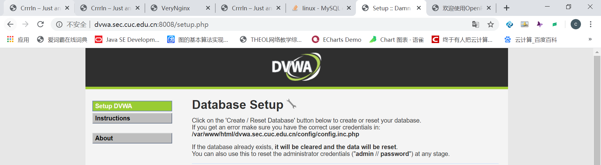

* ## 实验五：Web服务器

### 实验环境
- Ubuntu 18.04.4 Server 64bit
    - 网卡1
      - 连接方式：NAT
      - ip地址：10.0.2.15
    - 网卡2
      - 连接方式：Host-only 
      - ip地址：192.168.56.101
- 主机：Windows10 专业版
- nginx version: nginx/1.14.0 (Ubuntu)
- VeryNginx
- WordPress4.7
- DVWA
 
### 环境配置
**1.配置网卡**
```
#启动第二块网卡
sudo ifconfig emp0s8 up

用DHCP更新第二块网卡地址
sudo dhclient emp0s8
```
**2.安装nginx**
  ```
  #更新
  sudo apt-get update

  #安装
  sudo apt-get install nginx

  # 验证是否安装成功
  sudo nginx -t
   ```
  输入ip地址`192.168.56.101`后显示如下图，nginx已成功安装
  
  
**3.安装VeryNginx**

安装过程
  ```
  #安装git
  sudo apt install git

  #将所需要的VeryNginx克隆到本地
  git clone https://github.com/alexazhou/VeryNginx.git

  #安装所需依赖包
  sudo apt-get update
  sudo apt install libssl libssl1.0-dev
  apt install libpcre3 libpcre3-dev
  sudo apt install zlib1g-dev
  sudo apt install gcc 
  sudo apt install make

  #切换目录
  cd VeryNginx

  #安装Verynginx
  sudo python install.py install
  ```
配置文件过程
```
#修改主机hosts文件
#文件位置位于C:\Windows\System32\drivers\etc\hosts
#添加命令：192.168.56.101 vn.sec.cuc.edu.cn

#修改配置文件
#文件：/opt/verynginx/openresty/nginx/conf/nginx.conf
#修改：将server监听端口修改为8080，user修改为 www-data
```
启动、停止和重启服务
```
#启动服务
/opt/verynginx/openresty/nginx/sbin/nginx

#停止服务
/opt/verynginx/openresty/nginx/sbin/nginx -s stop

#重启服务
/opt/verynginx/openresty/nginx/sbin/nginx -s reload
```

首先登录


登录时，默认用户名和密码都是 verynginx 


**4.基于LEMP安装WordPress**

下载Mysql、PHP
```
#安装PHP
sudo add-apt-repository universe
sudo apt install php-fpm php-mysql

#配置PHP-FPM进程的反向代理在nginx服务器上
sudo vim /etc/nginx/sites-enabled/default

#具体修改
location ~ \.php$ {
    include snippets/fastcgi-php.conf;
    fastcgi_pass unix:/var/run/php/php7.2-fpm.sock;
}
#重启nginx
sudo systemctl restart nginx
```
下载WordPress

```
#下载wordpress-4.7.zip
sudo wget https://wordpress.org/wordpress-4.7.zip

#解压
sudo apt install unzip
unzip wordpress-4.7.zip

#创建指定路径
sudo mkdir /var/www/html/wp.sec.cuc.edu.cn

#移动解压后的wordpress文件
sudo cp -r wordpress /var/www/html/wp.sec.cuc.edu.cn
```
安装PHP扩展
```
#安装
sudo apt install php-curl php-gd php-intl php-mbstring php-soap php-xml php-xmlrpc php-zip

#重启php
sudo systemctl restart php7.2-fpm

```
下载配置数据库
```
#下载安装mysql   
sudo apt install mysql-server

#进入root用户，默认没有密码
sudo mysql -u root -p

#配置mysql
#新建一个数据库wordpress
CREATE DATABASE wordpress DEFAULT CHARACTER SET utf8 COLLATE utf8_unicode_ci;

#新建一个用户
CREATE USER 'wordpress'@'localhost' IDENTIFIED BY 'wordpress';

#刷新
FLUSH PRIVILEGES;

#退出数据库
EXIT;
```
Nginx配置
```
sudo vim /etc/nginx/sites-enabled/default

root /var/www/html/wp.sec.cuc.edu.cn;
```
添加hosts文件添加`192.168.56.101 	wp.sec.cuc.edu.cn`，登录`wp.sec.cuc.edu.cn`即可正常访问。


登录后通过配置个人账户信息


**5.安装DVWA**

安装DVWA
```
#下载安装DVWA
sudo git clone https://github.com/ethicalhack3r/DVWA /tmp/DVWA
sudo mv /tmp/DVWA /var/www/html

#重命名文件
sudo cp /var/www/html/DVWA/config/config.inc.php.dist /var/www/html/DVWA/config/config.inc.php
```
配置mysql并修改DVWA中的配置
```
#新建数据库dvwa
CREATE DATABASE dvwa DEFAULT CHARACTER SET utf8 COLLATE 
utf8_unicode_ci;

#新建mysql用户名和密码
GRANT ALL ON dvwa.* TO 'dvwauser'@'localhost' IDENTIFIED BY 'p@ssw0rd';
FLUSH PRIVILEGES;
EXIT;

#重启mysql
sudo systemctl restart mysql

#修改配置文件
sudo vim /var/www/html/DVWA/config/config.inc.php
 
#修改内容
 $_DVWA[ 'db_server' ]   = '127.0.0.1';
 $_DVWA[ 'db_database' ] = 'dvwa';
 $_DVWA[ 'db_user' ]     = 'dvwauser';
 $_DVWA[ 'db_password' ] = 'p@ssw0rd';
```
修改php的配置
```
sudo vim /etc/php/7.2/fpm/php.ini

#修改内容
allow_url_include = on
allow_url_fopen = on
display_errors = off

#重启php-fpm使配置生效
sudo systemctl restart php7.2-fpm
```
设置DVWA文件夹访问权限
```
sudo chown -R www-data.www-data /var/www/html/DVWA
```
修改nginx配置文件
```
#打开nginx配置文件
sudo vim /etc/nginx/sites-enabled/default

#修改内容
server {
        listen 8008;
        root /var/www/html/DVWA;
        index index.html setup.php index.htm index.php index.nginx-debian.html;
         location / {
                try_files $uri $uri/ =404;
          }
        #配置php-fpm反向代理
        location ~ \.php$ {
                include snippets/fastcgi-php.conf;
                fastcgi_pass unix:/var/run/php/php7.2-fpm.sock;
        }
    }

#重启
sudo systemctl restart nginx
```
添加hosts文件添加`192.168.56.101 	dvwa.sec.cuc.edu.cn`访问`dvwa.sec.cuc.edu.cn`页面


### 安全加固
**使用IP地址方式均无法访问上述任意站点，并向访客展示自定义的友好错误提示信息页面-1**

添加`Matcher`


添加`Response`


添加`Filter`


此时以ip形式访问


#### 

**Damn Vulnerable Web Application (DVWA)只允许白名单上的访客来源IP，其他来源的IP访问均向访客展示自定义的友好错误提示信息页面-2**

添加`Matcher`


添加`Response`


添加`Filter`


不在白名单的客户端访问


在白名单的客户端访问



**在不升级Wordpress版本的情况下，通过定制VeryNginx的访问控制策略规则，热修复WordPress < 4.7.1 - Username Enumeration**
添加`Matcher`


添加`Response`


添加`Filter`


访问`wp.sec.cuc.edu.cn/wp-json/wp/v2/users/`

**通过配置VeryNginx的Filter规则实现对Damn Vulnerable Web Application (DVWA)的SQL注入实验在低安全等级条件下进行防护**

添加`Matcher`


添加`Response`


添加`Filter`


**VeryNginx的Web管理页面仅允许白名单上的访客来源IP，其他来源的IP访问均向访客展示自定义的友好错误提示信息页面-3**
添加`Matcher`


添加`Response`


添加`Filter`


**限制DVWA站点的单IP访问速率为每秒请求数 < 50, 限制Wordpress站点的单IP访问速率为每秒请求数 < 20, 超过访问频率限制的请求直接返回自定义错误提示信息页面-4**

添加`Response`


添加`Frequency Limit`


### 遇到的问题和解决方法

1.在输入`192.168.56.101:8080/verynginx/index.html`的时候无法正确进入网址，原因是使用了IE浏览器，卡了好久...后来用google一秒进 

2.没有权限无法更改hosts文件，通过查阅资料更改了权限
    [解决方法](https://www.jb51.net/os/win10/526668.html)

3.mysql在执行`sudo systemctl restart mysql`时报错`Job for mysql.service failed because the control process exited with error code.`多番尝试卡了好久好久，最后在师哥的帮助下重启就好了(感谢师哥，重启大法好呜呜)


        
### 参考文献
[linux-2019-jackcily]([linux-2019-jackcily](https://github.com/CUCCS/linux-2019-jackcily/blob/job5/job5/实验5.md))

[linux-2019-DcmTruman](https://github.com/CUCCS/linux-2019-DcmTruman/blob/0x05/0x05/实验报告.md)

  

