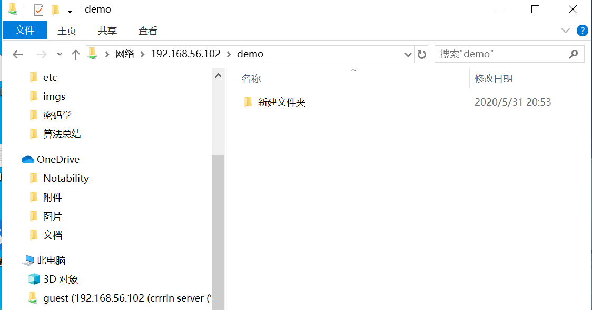

## 实验六：shell脚本编程练习进阶

### 实验环境
- ubuntu18.04 server 64bit
  - 工作主机：gaochangchang@gaochang, IP:192.168.56.101
  - 目标主机：root@crrrln, IP:192.168.56.102
### 实验要求
- FTP
  - 对照第6章课件中的要求选择一款合适的FTP服务器软件支持所有任务要求
- NFS
  - 对照第6章课件中的NFS服务器配置任务
- DHCP
  - 2台虚拟机使用Internal网络模式连接，其中一台虚拟机上配置DHCP服务，另一台服务器作为DHCP客户端，从该DHCP服务器获取网络地址配置
- Samba
  - 对照第6章课件中smbclient一节的3点任务要求完成Samba服务器配置和客户端配置连接测试
- DNS
  - 基于上述Internal网络模式连接的虚拟机实验环境，在DHCP服务器上配置DNS服务，使得另一台作为DNS客户端的主机可以通过该DNS服务器进行DNS查询
  - 在DNS服务器上添加 zone "cuc.edu.cn" 的以下解析记录
    ```
    ns.cuc.edu.cn NS
    ns A <自行填写DNS服务器的IP地址>
    wp.sec.cuc.edu.cn A <自行填写第5章实验中配置的WEB服务器的IP地址>
    dvwa.sec.cuc.edu.cn CNAME wp.sec.cuc.edu.cn
    ```
### 实验步骤
**1.配置工作主机到目标主机的远程SSH免密登录**

目标主机ssh配置
```
#开启ssh服务
sudo service ssh start

#修改ssh配置文件
sudo vim /etc/ssh/sshd_config

#修改内容
#设置可通过口令认证SSH
PasswordAuthentication yes

#允许root用户登录
PermitRootLogin yes

#重启ssh服务
sudo systemctl restart ssh
```
工作主机配置
```
#生成公私钥
ssh-keygen -f .ssh/key

#将公钥传输至目标主机authorized_keys文件
ssh-copy-id -i ~/.ssh/key root@192.168.56.102

#测试连接，输入密码
ssh root@192.168.56.102
```
目标主机免密配置
```
#修改ssh配置文件
sudo vim /etc/ssh/sshd_config

#修改内容
PasswordAuthentication no
PermitRootLogin without-password

#重启ssh服务
sudo systemctl restart ssh
```
免密登录
`ssh -i ~/.ssh/key root@192.168.56.102`,结果如下图


**2.FTP**

相关服务器配置
  - 选择服务器vsftpd
  - 脚本文件[vsftpd.sh](./相关文件/vsftpd.sh)
  - 配置文件[/etc/vsftpd.conf](./相关文件/vsftpd.conf)

通过工作主机运行脚本在目标主机安装vsftpd并完成相关配置
```
#将脚本文件vsftpd.sh拷贝到目标主机
scp -i .ssh/foo workspace/shell/vsftpd.sh root@192.168.56.102:workspace/

#实现目标主机控制安装和配置
ssh -i .ssh/key root@192.168.56.102 'bash workspace/vsftpd.sh'
```
**配置一个提供匿名访问的FTP服务器，匿名访问者可以访问1个目录且仅拥有该目录及其所有子目录的只读访问权限**


**配置一个支持用户名和密码方式访问的账号，该账号继承匿名访问者所有权限，且拥有对另1个独立目录及其子目录完整读写（包括创建目录、修改文件、删除文件等）权限，（该账号仅可用于FTP服务访问，不能用于系统shell登录）**

访问权限


删除文件、创建目录、修改文件


**FTP用户不能越权访问指定目录之外的任意其他目录和文件**


**匿名访问权限仅限白名单IP来源用户访问，禁止白名单IP以外的访问**


**3.NFS**

文件配置
  -  [nfs_s.sh](./相关文件/nfs_s.sh)
  -  [nfs_c.sh](./相关文件/nfs_c.sh)
  -  [/etc/exports](./相关文件/exports)

目标主机配置nfs服务器端，工作主机配置nfs客户端

创建的两个目录分别为:只读/nfs/gen_r和读写/nfs/gen_rw 


**两个共享文件目录对应只读和读写访问权限**


**共享目录中文件、子目录的属主、权限信息**

client端

server端


[根据资料](https://www.digitalocean.com/community/tutorials/how-to-set-up-an-nfs-mount-on-ubuntu-18-04)

```

By default, NFS translates requests from a root user remotely into a non-privileged user on the server. This was intended as security feature to prevent a root account on the client from using the file system of the host as root. 
no_root_squash disables this behavior for certain shares.
```
添加两个/home下的共享目录，分别设置no_root_squash和不设置no_root_squash

对于设置了no_root_squash的共享目录 


对于没有设置no_root_squash的共享目录，无法在工作主机(client)写入文件，创建目录


**4.DHCP**

文件配置
  -  [dhcp.sh](./相关文件/dhcp.sh)
  -  [/etc/dhcp/dhcpd.conf](./相关文件/dhcpd.conf)
  - [/etc/default/isc-dhcp-server](./相关文件/isc-dhcp-server)


其中，目标主机配置dhcp服务器端，工作主机配置dhcp客户端

将两台虚拟机增加网卡，网卡模式为内部网络模式


服务器端
```
#执行dhcp.sh
sudo bash dhcp.sh

#查看配置文件
less /etc/netplan/01-netcfg.yaml

#文件内容如下
 network:
   version: 2
   renderer: networkd
   ethernets:
     enp0s3:
       dhcp4: yes
   enp0s9:
     dhcp4: no
     addresses: [192.168.57.1/24]
```
客户端
```
#修改配置文件
sudo vim /etc/netplan/01-netcfg.yaml

#修改内容
#添加
enp0s9:
  dhcp4: yes

#查看配置文件
less /etc/netplan/01-netcfg.yaml

#文件内容如下
network:
   version: 2
   renderer: networkd
   ethernets:
     enp0s3:
       dhcp4: yes
     enp0s9:
       dhcp4: yes
```
实验结果


**5.DNS**

目标主机为服务端，工作主机为客户端

服务器端
```
#安装bind9
sudo apt install bind9

#修改配置文件
sudo vim /etc/bind/named.conf.options
#修改内容
#在options选项中增加
listen-on { 192.168.56.102; }; 
allow-transfer { none; }; 
forwarders {
   8.8.8.8;
    8.8.4.4;
};

#修改配置文件
sudo vim /etc/bind/named.conf.local
#修改内容
#增加
zone "cuc.edu.cn" {
    type master;
    file "/etc/bind/db.cuc.edu.cn";
};

#生成文件db.cuc.edu.cn
sudo cp /etc/bind/db.local /etc/bind/db.cuc.edu.cn

#修改文件db.cuc.edu.cn
sudo vim /etc/bind/db.cuc.edu.cn
#修改内容
#增加
        IN      NS      ns.cuc.edu.cn
ns      IN      A       192.168.56.102
wp.sec.cuc.edu.cn.      IN      A       192.168.56.102
dvwa.sec.cuc.edu.cn.    IN      CNAME   wp.sec.cuc.edu.cn.
```
客户端
```
#安装resolvconf
sudo apt update && sudo apt install resolvconf

#修改配置文件
sudo vim /etc/resolvconf/resolv.conf.d/head
#修改内容
#增加
search cuc.edu.cn
nameserver 192.168.57.1

#保存更改
sudo resolvconf -u
```
结果


**6.Samba**

**在windows 10客户端上连接Linux上的Samba服务器**

文件配置
- [samba.sh](./相关文件/samba.sh)
- [samba.conf](./相关文件/samba.conf)

输入共享文件夹路径


访问匿名目录，不用输入账号密码，且不可以创建文件夹 


访问指定用户文件夹，需要输入账号密码，且可以创建文件夹




**在Linux上连接Windows10上的服务器**

Windows设置共享目录：[参考](https://github.com/CUCCS/2015-linux-public-JuliBeacon/blob/exp6/实验%206/在Linux和Windows间设置文件共享.md)
```
#下载smbclient
sudo apt-get install smbclient

#查看共享目录
sudo smbclient -L 192.168.243.3 -U Dell
```


### 遇到的问题和解决方法
执行nfs_s.sh文件时，报错`E: Release file for http://ports.ubuntu.com/dists/bionic-backports/InRelease is not valid yet (invalid for another 14d 17h 36min 13s). Updates for this repository will not be applied.`
解决方法：更改了镜像源


### 参考资料

[how-to-install-and-configure-samba-on-ubuntu-18-04](https://www.myfreax.com/how-to-install-and-configure-samba-on-ubuntu-18-04/)

[更改镜像源](https://blog.csdn.net/zhangjiahao14/article/details/80554616)

[linux-2020-cuc-Lynn](https://github.com/CUCCS/linux-2020-cuc-Lynn/blob/chap0x06/chap0x06实验报告.md)

[linux-2019-luyj](https://github.com/CUCCS/linux-2019-luyj/blob/Linux_exp0x06/Linux_exp0x06/Linux_exp0x06.md)